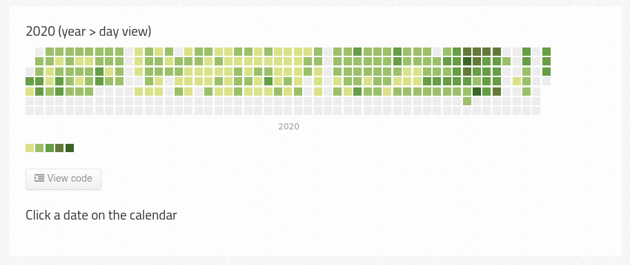

# tareator

## v1.0
- [x] Elegir nombre

### Funcionalidades básicas
- [x] Añadir tareas como pendientes
- [x] Marcar tareas como completadas
- [x] Marcar una tarea como "en progreso"

### Registro temporal
- [x] Generar `register.csv`
- [x] Añadir acciones (no tareas) que van directamente a `register.csv`

### Publicación en time-tracker
- [x] Generar `commit.tmp`
- [x] #alias
- [x] Editar `intervals.template`
- [x] Redondear con bloques de 15 mins

### Funcionalidades extra
- [x] Deshacer última acción
- [x] Subtareas

## v2.0

### Funcionalidades ocultas
- [x] Registrar "--{open,close} tareator--"
- [x] e (abrir `tareas.md` en editor)
- [x] r (abrir `register.csv` en editor)
- [x] --silent flag

### Visualización
- [ ] Demo mínima con cal-heatmap

